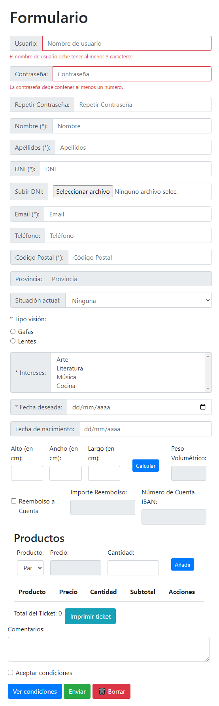

# simple_js_validator_form
Un formulario validado en JavaScript con un diseño simple en Bootstrap.

  

### **products.js:**

Este archivo contiene la declaración de productos, una clase para nodos de la lista de productos, y una clase para listas enlazadas. También incluye funciones para agregar, eliminar y actualizar productos en una lista de pedidos, así como eventos relacionados con la interfaz de usuario.

### **validator.js:**

Este archivo contiene funciones de validación para diversos campos, como fechas, teléfonos, correos electrónicos, contraseñas, códigos postales, entre otros. Estas funciones se utilizan para validar datos ingresados en formularios.

### **index.js:**
Este archivo implementa la lógica principal de la aplicación. Contiene eventos relacionados con la interfaz de usuario, como la apertura de un modal al hacer clic en el botón "Submit", la validación del formulario al enviarlo, y la manipulación del Date Picker. Además, tiene funciones para resetear el formulario, validar campos, calcular el peso volumétrico, habilitar/deshabilitar opciones de reembolso, entre otras.